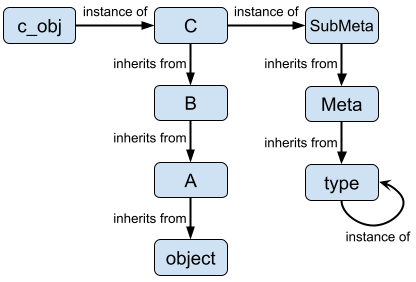

# Untrusted Data Types
Splice introduces **untrusted** data types and leverages the type system to
propagate *untrustiness*. A piece of data is untrusted if 1) its value is provided
by an untrusted source (e.g., a remote user from a network socket), or 2) its value
might be reassigned by Splice (i.e., when Splice performs *deletion-by-synthesis*).
Untrustiness propagates when untrusted data interacts with other untrusted or
trusted data, in a fashion similar to classic taint propagation. For example, in
an assignment-after-addition operation `z = x + y`, `z` becomes untrusted if and
only if at least one operand (i.e., either `x` or `y`, or both) is untrusted.

With the introduction of untrusted data types, Splice further leverages the type
system to force programmers to use **defensive programming**. Defensive programming
is essential for programs containing untrusted data, because any unchecked use
of such data can cause harm to the program or even the underlying system (e.g.,
SQL injection caused by malicious input from the network), or return bogus values.

## [Python Background](#python-background)
Python is a dynamically-typed, object-oriented programming language, in which
*everything* (e.g., literals, classes, functions) is an *object* and every object
has a *type* defined by the *class* from which the object was instantiated. The
type of object determines the *methods* (operations) that are available on that
object, which are defined in the class. Python supports multi-inheritance,
which allows a class to subclass from multiple base classes; therefore, methods
defined in base classes can be inherited or overridden by the subclass.
Every class also has a set of predefined *special methods*, as specified by
Python's **data model**, that enrich customized (i.e., user-defined) classes with
language features that emulate operations of built-in types. Those special methods
are in fact Python's approach to *operator overloading*. Their names are all
prefixed and affixed by two underscores and thus often referred to as "dunder"
(double-underscore) methods. For example, to allow a customized class to emulate the
addition operation (`+`) of numeric types (e.g., `int`), Python provides a special
method `__add__`. If the customized class defines `__add__`, Python invokes this
method when objects of the customized class are being summed together.

<details>
<summary>Special Methods Involving Binary Arithmetic Operations</summary>
Special methods involving *binary arithmetic operations* (e.g., `+`, `-`, and ``<<``)
have their corresponding *reflected* (or swapped) method with an additional "r"
prefixed in its method name (e.g., <code>__radd__</code> is <code>__add__</code>'s
reflected method). The reflected method is called 1) if the operands are of
different types, and the left operand does not define the non-reflected method,
or 2) if the right operand’s type is a *subclass* of the left operand’s type and
that subclass has a different implementation of the reflected method (instead of
inheriting the reflected method from the base class). For example, when evaluating
the expression <code>x + y</code>, if <code>x</code> and <code>y</code> are of two
different types, <code>y.__radd__(x)</code> is called if <code>x.__add__(y)</code>
is not implemented. On the other hand, if <code>y</code>'s type is a subclass of
<code>x</code>'s type, then <code>x.__add__(y)</code> is called if
<code>y.__radd__(x)</code> is not implemented. This latter case allows a subclass
to override its ancestors’ operations (without forcing the object of the subclass
to always be the left operand).
</details>

### Object Instantiation and Metaclass
Python's object instantiation process uses three special methods, `__new__`,
`__init__`, and `__call__`, involving both *class* and *metaclass*. Metaclass
is the class (or type) of a class. It can instantiate new classes just like a class
can instantiate new class instances. The relationships between a class instance
and a class, and between a class and a metaclass are illustrated below.


Both class and metaclass support inheritance. In a class inheritance chain, the
root is always the `object` class, while in a metaclass inheritance chain, the
root is always the `type` metaclass. For ease of discussion, we will use the
following classes and metaclass as an example:
```python
class Meta(type):
    pass

class A(object):
    pass

class B(A):
    pass

class C(B, metaclass=Meta):
    pass

c_obj = C()
```
The relationships between those classes (and the `c_obj` instance) are illustrated
below.



Note that class inheritance does not need to be linear while metaclass inheritance
does. We will not complicate our discuss with a diamond inheritance scheme in this
document. Note also that `type` metaclass is its own type; we can think of `type`
as the ultimate source of Python's object creation process.

Class inheritance allows methods defined in a class to be inherited from a subclass.
That is, for example, a method defined in `B` can be invoked by `c_obj` if `C` does
not define the same method to *override* `B`'s method. Python resolves a method
in a class's inheritance chain based on the *method resolution order*, or MRO.
In our example above, when a method is invoked by `c_obj`, Python follows the
`C->B->A->object` MRO to resolve the method. A method can also invoke the same
method along the MRO so that the overriding method does not simply replace the
same methods defined in the rest of the MRO. This can be done by using `super()`
to identify the next base class that defines the same method and then calling the
base class' method in the subclass. This property is particularly important for
instance creation, as we will see next.

The general workflow of creating a new class instance is illustrated
below <sup id="a1">[1](#f1)</sup>:


In our example, to create `c_obj`, `Meta`'s `__call__` special method is first
invoked, which calls `__new__` and `__init__` special methods defined in
`C`. <sup id="a2">[2](#f2)</sup> The new instance (i.e., `c_obj`) is eventually
returned by `__call__`. In our template code above, `__call__` is not defined
in `Meta`, so it is inherited from `type`. Similarly, Python cannot find `__call__`
or `__init__` defined in `C`, nor in `B` or `A`, so it follows the MRO and invokes
those methods defined in `object`. `type` and `object` are Python's default
instance creation approach. We can customize this process by overriding `__call__`
in `Meta` or `__new__` and `__init__` in `C`, `B`, and/or `A`.
> `__call__` is only invoked when the callable class object is called (i.e., `C()`).
> One can bypass `__call__` and construct a new class instance directly by invoking
> `c_obj = C.__new__(...)` and then `c_obj.__init__(...)`. However, this is not a
> common practice.

#### Customize `__call__` in Metaclass
We can override `type`'s `__call__` to customize object instantiation. Generally,
regardless of customization, `__call__` should invoke `__new__` and `__init__`
and return the created instance. For example, we can customize `__call__` in `Meta`:
```python
class Meta(type):
    def __call__(cls, *args, **kwargs):
        instance = cls.__new__(cls, *args, **kwargs)
        instance.__init__(*args, **kwargs)
        return instance
```
`Meta`'s `__call__` overrides the default (i.e., `type`) `__call__`, so when
`c_obj` is being constructed, i.e., `c_obj = C()`, `Meta`'s `__call__` is invoked.
Notice that `__call__` is what makes the class object `C` callable (i.e., `C()`).
Similarly, if we define `__call__` in `C`, `c_obj` becomes callable (i.e., we can
do `c_obj()`). `args` and `kwargs` are the positional and keyword arguments passed
into `C()`. In our example, they are both empty, but if we do,
```python
c_obj = C("this is an example", 1, level=3, demo=True)
```
Then the positional arguments, `args[0] = "this is an example"` and `args[1] = 1`
and the keyword arguments `kwargs["level"] = 3` and `kwargs["demo"] = True`
will be passed to `__call__`. In our customized `__call__` implementation, those
arguments will subsequently be passed to `C`'s `__new__` and `__init__` methods.
`c_obj` is the `instance` that is returned by `__call__`. Depending on how `C`
(or its base classes) defines `__new__` and `__init__`, `__call__` might not be
allowed to pass arbitrary arguments to them. Let's take a closer look at those
methods.

#### Customize `__new__` and `__init__` in Class
We can override `object`'s `__new__` and `__init__` to further customize object
instantiation. For `__new__`, however, we must ensure `object`'s `__new__` is
eventually called to allocate memory for the new instance. `__init__` on the other
hand, has no such requirement, but prematurally terminating the inheritance chain
of `__init__` methods can lead to incomplete initialization of an instance. For
example, we can customize `C`, `B`, and `A` as the following:
```python
class C(B, metaclass=Meta):
    def __new__(cls, *args, **kwargs):
        print(kwargs["level"])
        del kwargs["level"]  # remove "level" keyword argument from kwargs
        obj = super().__new__(cls, *args, **kwargs)
        return obj

    def __init__(self, *args, **kwargs):
        assert len(args) == 2    # both positional arguments are passed to args
        assert len(kwargs) == 1  # only "demo" argument is passed to kwargs
        self.demo = kwargs["demo"]
        super().__init__(*args, **kwargs)


class B(A):
    def __new__(cls, *args, **kwargs):
        assert len(kwargs) == 1  # kwargs should contain only "demo"
        obj = super().__new__(cls, *args, **kwargs)
        return obj

    def __init__(self, *args, **kwargs):
        assert len(args) == 2
        assert len(kwargs) == 1
        self.num = args[1]


class A(object):
    def __new__(cls, *args, **kwargs):
        assert len(args) == 2
        assert len(kwargs) == 1
        print("args[0] = {}, args[1] = {}".format(args[0], args[1]))
        obj = super().__new__(cls)
        return obj

    def __init__(self, *args, **kwargs):
        self.str = args[0]

c_obj = C("this is an example", 1, level=3, demo=True)
```
The customization above demonstrates various properties during object instantiation.
1. When `Meta`'s `__call__` calls `C`'s `__new__`, all arguments given to the `C()`
   are passed into `__new__`. After `C`'s specific customization is finished, it
   calls `super()` to invoke `__new__` of its base class (i.e., `B`) before
   returning the instance.
2. `C`'s `__new__` removes the keyword argument `level` from `kwargs`. As such,
   The `kwargs` passed to future base classes no longer contains `level`. This is
   particularly useful if `C` anticipates that the argument is unique to `C` and may
   not be accepted by any of its base classes. The remaining arguments are passed to
   `B`'s `__new__`.
3. `A`'s base class is `object` whose `__new__` does not take any other arguments
   but the class itself. Therefore, `A` "consumes" `args` and `kwargs` and only
   passes `cls` to `super()`.
4. From `Meta`'s `__call__`, we see that `args` and `kwargs` are subsequently passed
   to `__init__`. Since `C` defines an `__init__`, that's the method that is invoked
   after `__new__`. Note that since `kwargs` has been modified in `__new__`,
   `__init__` gets only one keyword argument (i.e., `demo`).
5. `C`'s `__init__` sets an attribute for the instance (i.e., `self.demo`) and uses
   `super()` to call `B`'s `__init__`. However, `B`'s `__init__` does not invoke
   `super().__init__` at all, so `A`'s `__init__` will never be called in this case.

The call graph to construct `c_obj` is illustrated below.


## Splice in Python
Python's multi-inheritance programming model enables Splice to modify the behavior
of existing Python classes, so that objects in a Splice-managed program can
transparently propagate untrustiness without annotations from the programmer.

Specifically, in a Splice-managed program, data objects must be either trusted or
untrusted, and untrusted objects must be either synthesized (if their values were
reassigned by Splice) or non-synthesized. Python creates new data objects in two ways:
1) *Explicitly*, when developer-written code directly calls a class object as a
   function call. For example, to explicitly create an integer object, the developer
   can call the built-in `int` class object:
   ```python
   # the built-in int class object
   class int(object):
       ...
       # attributes associated with the class object
   i = int(0)  # calling the class object as a function call
   ```
2) *Implicitly*, when developer-written code triggers an execution path that creates
   a new object. For example, summing two `int` objects implicitly creates a new
   `int` object and so does getting the absolute value of an `int` object:
   ```python
   x = int(3)
   y = int(-4)
   a = x + y   # a is a new int object
   b = abs(x)  # b is also a new int object
   ```
Splice needs to interpose on both types of object creation to ensure that
untrustiness always propagates into newly-created objects during execution, thus
preventing new objects from accidentally terminating untrustiness flow prematurely.
Interposing on implicit object creation paths is challenging because 1) not all
paths create new objects. Splice must differentiate the ones that do from the ones
that do not; 2) while it is clear from explicit object creation the type of
object being created (which is the same as the class object), it depends on the
nature of the operation to determine object type(s) from implicit object
creation. For example, true division of two `int` objects creates a new `float`
object, while floor division creates a new `int` object:
```python
x = int(5)
y = int(2)
a = x / y   # a is a float object created from true division
b = x // y  # b is an int object created from floor division
```
For execution paths that do not create new objects, a further complication arises
when a path *mutates an existing object* involved in the execution.
For example, when a byte is appended to an existing `bytearry` object, the operation
does not create a new `bytearray` but mutates the existing `bytearray` object
in-place:
```python
b = bytearray([0, 1, 2])
b.append(3)  # The bytearray object is mutated, but no new bytearray object is created
```
Splice must interpose on all execution paths that mutate existing objects, because
mutation can alter the untrustiness of those objects and therefore affect how
untrustiness propagates from them.

In general, any execution path on a *mutable* object may mutate the object and/or
implicitly create new objects, but any execution path on an *immutable* object may
only create new objects. While objects of most (but not all) built-in types are
immutable, developer-defined classes are typically mutable by default, but it is
possible to programmatically enforce immutability for such classes.

As mentioned in [Python Background](#python-background), special methods are Python's
approach to operator overloading and are called when an execution path invokes their
corresponding operators. Splice treats some special methods differently from other
one (or non-special methods), because those methods do not create or modify
objects *as a result of the data flow* within a program. Instead, they determine the
*control* of data objects and their information flow. For example, as we shall see
in [Managing `str`](#managing-str), `__iter__` is a special method that creates an
iterator for a program to iterate through an iterable object (e.g., a string or
a list). The iterator only controls how actual data objects (e.g., characters in a
string or items in a list) are visited (e.g., in a `for` loop). Therefore, Splice
must ensure that untrustiness propagates to those data objects, not the iterator
object itself.

Splice interposes on each existing class through inheritance to 1) introduce the
`trusted` and `synthesized` attributes to its instantiated objects during object
creation, and 2) propagate those attributes according to a set of rules (discussed
below) when methods manipulate the objects, but 3) otherwise preserve the behavior
of the existing class. For clarity of exposition, we henceforth call the interposed
class a Splice-managed class and prefix all Splice-managed class names with `Splice`.
For example, a Splice-managed `int` class is denoted as `SpliceInt`, and it
interposes on the built-in `int` type.<sup id="a3">[3](#f3)</sup>
For the programmer, defensive programming means that the programmer should always
check the attributes of an object before meaningfully using the object (e.g.,
displaying the value of the object to a client's browser). Splice also assists
defensive programming at places where only trusted data should exist (e.g., at
[trusted sinks](#trusted-sinks)).

Given the discussion above, we can now enumerate 1) the kinds of program behavior
that Splice must interpose on, and 2) what Splice must do for each kind of behavior
to ensure accurate propagation of (un)trustiness/synthesis.
1. In general, for explicit object creation, Splice interposes on the class creation
   process (metaclass) by overriding the `__call__` special method on the *class
   object*, which controls the `__new__` and `__init__` special methods that would
   be invoked by a class to instantiate a new object of the class. Splice returns
   an untrusted (synthesized) object if *any* input argument to object creation is
   untrusted (synthesized). Splice also adds two optional binary arguments,
   `trusted` and `synthesized`, to be available for any explicit object creation
   call, so that the creation process can directly set those attributes. However,
   those arguments can only *downgrade* the object's trustiness. That is, for example,
   if all other input arguments to construct an object are trusted, one can set the
   `trusted` argument to `False` to make the object untrusted. However, if at least
   one input argument is untrusted (and thus the object should be untrusted),
   setting the `trusted` argument to `True` leads to an error.
   > This rule applies to most objects, such as `int()` and `float()` that explicitly
   > create `int` and `float` objects. Here are some examples using `int()`:
   > ```python
   > from django.splice.splicetypes import SpliceInt as int
   > from django.splice.splicetypes import SpliceStr as str
   >
   > i = int(9)  # i is trusted and non-synthesized.
   > j = int(9, trusted=False, synthesized=True)  # j is untrusted and synthesized.
   > s = str("9", trusted=False, synthesized=False)  # s is an untrusted and non-synthesized string.
   > k = int(s)  # k is untrusted and non-synthesized because of s.
   > x = int(s, trusted=True)  # Error: s is untrusted but the trusted flag is set to True.
   >```
2. For implicit object creation from an execution path, the return object of a
   method is untrusted (synthesized) if at least one input argument is untrusted
   (synthesized).
   > This rule applies to methods on both immutable and mutable calling objects.
   > Note that, as briefly discussed above, not all operations should propagate
   > untrustiness/synthesis this way, and not all objects have untrustiness/synthesis
   > attributes (see [Technical Details](#technical-details)).
3. For methods that are not class methods or static methods, the first argument,
   which is the calling object, becomes untrusted (synthesized) if its value is
   modified *and* if any remaining input argument is untrusted (synthesized).
   > This rule applies to methods that modify the mutable calling object.
   > :construction: For class methods and static methods, the first argument is
   > not the calling object. Therefore, we cannot follow this rule.
4. The programmer can grant trust to an object, but this action must be performed
   explicitly (by calling a `to_trusted()` function), so that the programmer's
   intent is expressed clearly in the code.

> :construction: The rules do not yet cover all possible scenarios for untrustiness
> propagation, for example, when a class method modifies an existing object in-place.

In summary, a Python program running on top of Splice runs just like a regular
program without Splice, except that:
1. *All* classes in the program, including built-in, library, and developer-defined
   classes, must be interposed by Splice so that operations between objects
   propagate untrustiness/synthesis. Splice leverages inheritance to make this
   process as transparent to the programmer as possible.
2. The programmer should practice **defensive programming**, especially when
   untrusted or synthesized objects are involved. This practice should in fact
   be adopted for any program that may process malicious data, regardless of
   Splice's presence. At times, Splice enforces proper handling of
   untrusted/synthesized objects, for example, at [trusted sinks](#trusted-sinks),
   where only trusted objects are allowed.

### [Technical Details](#technical-details)
Splice leverages class inheritance to manage existing classes. A Splice-managed
class inherits from an existing class and a `SpliceMixin` class, which must be
inherited by all Splice-managed classes. `SpliceMixin` contains most logic needed
for managing untrustiness/synthesis. For example, a Splice-managed `int` class,
denoted below as `SpliceInt`, is defined as:
```python
from django.splice.splice import SpliceMixin

class SpliceInt(SpliceMixin, int):
    pass
```
Note that `SpliceMixin` must be inherited before `int`. We use the `int`
type as the running example for the rest of this section. See
[Create a New Splice-Managed Class](#create-a-new-splice-managed-class) for a
different example.

One important task of `SpliceMixin` is to *decorate* the methods inherited from
the existing class (`int`) so that the subclass (`SpliceInt`) 1) mimics the
behavior of the existing class, while 2) propagating untrustiness/synthesis.
`SpliceMixin` does so through the `__init_subclass__` special method. It iterates
over all methods defined in the subclass and all of its base classes following the
MRO. `SpliceMixin` decorates those methods and makes them the attributes of the
Splice-managed subclass directly; therefore, they are no longer resolved from the
base classes in which they were originally defined. The iteration process adheres
to the following order:
1. `SpliceMixin` first considers all callable methods defined in the Splice-managed
   subclass. For an application-specific class, the subclass is usually just a
   declaration without any methods defined. However, the programmer can leverage
   this class to *prevent* any inherited method from being automatically decorated
   by `SpliceMixin` through overriding. Splice stipulates that method names must
   be prefixed by either `splice_` or `_splice_` for the subclass' methods to be
   automatically decorated. The programmer, if desired, can also implement new methods
   that propagate untrustiness/synthesis and not follow this naming convention.
2. All methods in `SpliceMixin` are then considered, but they are internally
   managed by Splice.
3. Finally, Splice considers callable methods in the base classes. To ensure that
   decorated methods are the ones that would have been resolved in the MRO,
   decoration follows the MRO, and methods that have been decorated will not be
   considered again if they appear again later in the MRO (this rule also
   applies to methods that Splice have already encountered in (1) and (2)).

Therefore, after the decoration process is finished, the new MRO will be:
1. All methods defined in the Splice-managed class (both decorated and
   non-decorated) and all decorated methods from all the base classes.
2. All methods defined in `SpliceMixin`.
3. All other non-decorated methods from classes other than the Splice-managed class
   and `SpliceMixin`, resolved by the original MRO.

> Some methods provide functionality that should not propagate untrustiness/synthesis;
> therefore, they are skipped during the iteration and not decorated.
> <details>
> <summary>List of Non-decorated Methods</summary>
> Special methods that create, initialize, or destroy class instances
> (note that Splice controls class object instantiation through metaclass):
>
> 1. `__init__`
> 2. `__new__`
> 3. `__del__`
>
> Special methods that control attribute access for class instance:
> 1. `__getattr__`
> 2. `__getattribute__`
> 3. `__setattr__`
> 4. `__delattr__`
> 5. `__dir__`
> 6. `__get__`
> 7. `__set__`
> 8. `__delete__`
> 9. `__set_name__`
> 10. `__slots__`
>
> Special methods that control class creation:
> 1. `__init_subclass_`
> 2. `__prepare__`
> 3. `__class__`
>
> Special methods that control instance and subclass checks:
> 1. `__instancecheck__`
> 2. `__subclasscheck__`
> 3. `__subclasshook__`
>
> Special methods that used to emulate container types (we will discuss
> these methods later):
> 1. `__iter__`
> 2. `__reversed__`
>
> Special methods that control "With" statement context managers:
> 1. `__enter__`
> 2. `__exit__`
>
> Special methods that control how class instances are pickled and unpickled
> 1. `__getnewargs_ex__`
> 2. `__getnewargs__`
> 3. `__getstate__`
> 4. `__setstate__`
> 5. `__reduce__`
> 6. `__reduce_ex__`
>
> </details>

In general, Splice transparently handles the iteration and decoration process,
without additional help from the programmer.

#### Method Decoration
Splice decorates a method by first calling the method (e.g., as inherited from
the base class) to perform the operation and then attaching the `trusted` and
`synthesized` attributes to the return object (i.e., making the object
Splice-managed) or modifying attribute values in a Splice-managed object. For example,
to decorate `int`'s `__add__` method, Splice re-classes the output `int` object to
Splice-managed `SpliceInt` and returns the Splice-managed object instead. For
mutable objects, Splice modifies the `trusted` and `synthesized` attributes of the
objects if untrusted input objects are involved in the operation.
> :construction: The programmer must ensure that the returned object has a
> corresponding Splice-managed class for Splice to re-class. At the moment, Splice
> cannot automatically generate a new Splice-managed class from an existing class.
> As a result, if Splice is unaware of any appropriate Splice-managed class for
> the returned object, the original object will be returned with a warning, since
> the object has "escaped" Splice's management, and untrustiness/synthesis will
> no longer be propagated afterwards. We plan to automate the class discovery and
> conversion process in the future.

<details>
<summary>Identify The Right Splice-Managed Class Through Registration</summary>
Splice registers existing classes with their corresponding Splice-managed classes
so that it knows how to re-class a return object of e.g., a built-in type
to be of a Splice-managed class during decoration. Registration is done in
<code>SpliceMixin</code> through reflection of the inheritance chain.
</details>

<details>
<summary>Special Methods Related to Built-in Functions with Python-Enforced
Return Type
</summary>
Some special methods can override the functionality of an operator (i.e., built-in
functions) but Python enforces a particular type to be returned by the operator.
For example, <code>__len__</code> can override the built-in <code>len()</code>
function, but Python enforces the return type to be the built-in <code>int</code>,
even though Splice decorates <code>__len__</code> to return a Splice-managed
<code>SpliceInt</code> object. As such, untrustiness/synthesis propagation is
terminated. The following is the list of such functions and their corresponding
special method:

1. `len()` (special method: `__len__`)
2. `hash()` (special method: `__hash__`)

Splice addresses this issue by replacing (shadowing) these functions so that they
directly output the decorated object of their special method.
</details>

Splice cannot manage operations on literals, except through reflected methods.
For example,
```python
x = int(5) + 5  # x is a Splice-managed int object because int() is managed by Splice
y = 5 + 5       # y is a built-in int object because Splice cannot control operations on only literals
```
However, when a literal object invokes a binary arithmetic method (e.g., `+`) and
the right operand is an object of the literal's corresponding Splice-managed class,
Splice can rely on the class' reflected method to take control of the operation.
However, reflected method is only invoked if operators are used, not if special
methods are called directly. For example,
```python
from django.splice.splicetypes import SpliceInt as int

i = 1               # type(i) == int (built-in type)
x = int(1)          # type(x) == SpliceInt
p = x + i           # type(p) == SpliceInt, handled by __add__ in SpliceInt
q = i + x           # type(q) == SpliceInt, handled by the reflected __radd__ in SpliceInt
w = i.__add__(x)    # type(w) == int, because the reflected method is not invoked
```
> :construction: We plan to address this issue by analyzing the program code and
> directly replacing all literals with their constructors.

Additionally, any `boolean` operation must return a boolean value and is not
allowed to be managed by Splice.

#### [Managing `str`](#managing-str)
Using `str` as an example, we discuss additional considerations when managing
existing classes. Some considerations are specific to `str`, while others
are more general, applicable to a wide range of data types (e.g., all classes
that are iterable).

`str` is an iterable class. That is, we can iterate over each character in a
`str` object, like this:
```python
s = str("A string is iterable")
for char in s:
    pass
```
A special method `__iter__`, which returns an *iterator* object, is what makes
iteration possible. However, we should not decorate the iterator object per se,
but the object returned by the iterator. As such, Splice overrides `__iter__` in
`SpliceMixin`, invoking the iterator of the existing class (if defined) and
re-classing the objects returned by the iterator to be the Splice-managed class.
Note that, Splice interposes on the iteration behavior of *all* iterable classes,
not just `str`.

Splice considers string (i.e., `str()`, `__str__`, and the similar `repr()`,
`__repr__`, `format()`, and `__format__`) to be a trusted sink; therefore,
Splice raises an error if input to these functions/methods is not
trusted.<sup id="a4">[4](#f4)</sup> This is different from how Splice manages
other object creation methods.

Not all binary arithmetic methods have a corresponding reflected (swapped) method.
As specified in Python's data model, it is important that the emulation
(i.e., use of special methods) only be implemented to the degree that it makes
sense for the object being modeled. `str` defines the `__add__` method that
concatenates two strings to create a new string, but since concatenation is not
a *commutative* operation, `__radd__` is not implemented in the built-in type.
Consequently, Splice cannot leverage reflected methods to propagate
untrustiness/synthesis (as discussed above). For example,
```python
from django.splice.splicetypes import SpliceStr as str
s = "Hello " + str("world!")
```
Without `__radd__`, the built-in `str` object (i.e., `"Hello "`) invokes `__add__`
and creates a new built-in `str` object, `"Hello world!`. If `__radd__` were defined,
since `SpliceStr` is a subclass of `str`, Python would invoke `__radd__` of the
the `SpliceStr` object, and the return object would be a Splice-managed object.
Thus, Splice defines a `__radd__` in `SpliceStr`. Note that `__radd__` is *not*
directly defined in `SpliceMixin`, which would affect all Splice-managed classes,
because having `__radd__` may not make sense for all existing classes.

<details>
<summary>Note on <code>__mul__</code> and <code>__rmul__</code> in <code>str</code></summary>
It is not always the case that a reflected method would address the type issue
like the one we discussed above. For example, we can use <code>*</code> to
concatenate the same string multiple times, like this:

```python
s = "Hello "
ss = s * 2   # ss is "Hello Hello ", and str's __mul__ was invoked
rss = 2 * s  # rss is also "Hello Hello ", but str's __rmul__ was invoked
```
In the second statement, <code>s</code> invokes the <code>mul</code> special method,
but in the third statement, <code>s</code> invokes the <code>rmul</code> method
after Python determines that <code>int</code>'s <code>mul</code> cannot handle this
type of multiplication. In both cases, if <code>s</code> is a built-in
<code>str</code> object, Splice cannot manage these operations, even if the integer
is managed by Splice.
</details>

# Deletion by Synthesis
:lock_with_ink_pen:

## Customize a Synthesizer
Splice provides a number of built-in synthesizers (e.g., `IntSynthesizer`,
`FloatSynthesizer`, `StrSynthesizer`) that can synthesize different types of
objects (e.g., `int`, `float`, and `str`). All synthesizers inherit from the base
class `Synthesizer` and output objects of their corresponding Splice-managed type
(e.g., `SpliceInt`, `SpliceFloat`, and `SpliceStr`). Using these fundamental
synthesizers, the programmer can (in most cases) easily create new synthesizers
for other existing classes. It is recommended that a customized synthesizer should
also inherit from `Synthesizer`. Additionally, the new synthesizer *must* return
objects of Splice-managed type. This may entail creating a new Splice-managed class,
which can be done through inheritance. We use an example to illustrate this process.

### Create `DatetimeSynthesizer`
The following are the steps to create a synthesizer that synthesizes Python's
`datetime` objects:
1. Create a new synthesizer class `DatetimeSynthesizer` that inherits from
   `FloatSynthesizer`.
2. Define a new method in the class that converts a `datetime` object to a
   `float` object, e.g., by calling `datetime`'s `timestamp()` method.
3. Override `to_python()` in the class to convert the synthesized `float` value
   to a `datetime` object and then re-class the `datetime` object to its
   corresponding Splice-managed type `SpliceDatetime` (see
   [Create a New Splice-Managed Class](#create-a-new-splice-managed-class)).
4. Override `simple_synthesis()` in the class to return an `SpliceDatetime`
   object with its `trusted` attribute set to `False` and `synthesized` attribute
   to `True`.

The code for `DatetimeSynthesizer` would look like this:
```python
from django.splice.synthesis import FloatSynthesizer

class DatetimeSynthesizer(FloatSynthesizer):
    @staticmethod
    def to_float(value):
        # Convert value (a datetime object) to float.
        pass

    @staticmethod
    def to_python(value):
        # Override FloatSynthesizer's to_python() to
        # convert a float object back to a datetime
        # object and return a Splice-managed object.
        pass

    @staticmethod
    def simple_synthesis(value):
        # Override FloatSynthesizer's simple_synthesis()
        # to return a Splice-managed datetime object with
        # the trusted flag set to False and the synthesized
        # flag to True.
        pass
```
When a `datetime` object is to be synthesized, the programmer should call
`to_float()` first to convert the value to `float` and then use
`DatetimeSynthesizer` like a `FloatSynthesizer`. `to_python()` and
`simple_synthesis()` must return an `SpliceDatetime` object, not Python's
`datetime` object, which requires us to define an `SpliceDatetime` class.

### [Create a New Splice-Managed Class](#create-a-new-splice-managed-class)
The common template to create a new Splice-managed class (and in this example,
the `SpliceDatetime` class) looks like this:
```python
import datetime
from django.splice.splice import SpliceMixin

class SpliceDatetime(SpliceMixin, datetime):
    """Subclass Python datetime module's datetime class and SpliceMixin."""
    @classmethod
    def splicify(cls, value, trusted, synthesized):
        year = value.year
        month = value.month
        day = value.day
        hour = value.hour
        minute = value.minute
        second = value.second
        microsecond = value.microsecond
        return SpliceDatetime(year=year,
                              month=month,
                              day=day,
                              hour=hour,
                              minute=minute,
                              second=second,
                              microsecond=microsecond,
                              trusted=trusted,
                              synthesized=synthesized)
```
An `SpliceDatetime` object will behave exactly like a `datetime` object
except that it is now managed by Splice (for untrustiness/synthesis). All methods
in `SpliceDatetime` are inherited from `datetime` and decorated by `SpliceMixin`.
However, in this particular example, the programmer must override the `splicify()`
class method that constructs a `SpliceDatetime` object from a `datetime` object,
which is referenced by the `value` parameter. This override is usually *not*
necessary for user-defined, program-specific classes (as long as they are heap types
or ModuleType subclasses); they most likely can inherit `splicify()` directly from
`SpliceMixin`.

Occasionally, the programmer may determine that some methods should *not* be managed
by Splice. The programmer can override those methods in `SpliceDatetime`. For example,
```python
import datetime
from django.splice.splice import SpliceMixin

class SpliceDatetime(SpliceMixin, datetime):
    def timetuple(self):
        # We simply call datetime timetuple() to override the
        # method so that timetuple() will not be decorated
        return super().timetuple()
```

`DatetimeSynthesizer` and `SpliceDatetime` are implemented in
`django.splice.synthesis` and `django.splice.splicetypes`, respectively,
for reference.

# [Trusted Sinks](#trusted-sinks)
Trusted data sinks are locations where only non-synthesized data is allowed.

:lock_with_ink_pen:

# Footnotes
<b id="f1">1.</b> Credit to
[this article](https://blog.ionelmc.ro/2015/02/09/understanding-python-metaclasses/#putting-it-all-together). [↩](#a1)

<b id="f2">2.</b> We omit details on how a class is created by the metaclass, which
involves a metaclass specific special method `__prepare__` and the `__new__` and
`__init__` special method defined in the metaclass.

<b id="f3">3.</b> In a Splice-managed Python program, *all* classes should be
managed (i.e., replaced) by Splice, including built-in, library, and
application-specific (developer-defined) classes, for untrustiness/synthesis
to propagate properly. [↩](#a3)

<b id="f4">4.</b> This is a design choice we made specifically for Django,
because Django formats HTTP strings before rendering them to the client. Since
string formatting is a trusted sink, all content delivered to the client then
becomes safe to be rendered. This design choice can be easily adjusted so that
string follows Rule 1 just like other data types. [↩](#a4)
